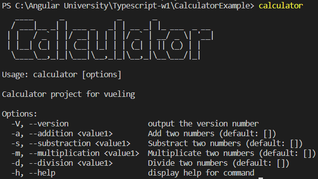

# Calculator test

Usage example of ***@gdenisvueling/basic-calculator*** library.

## Usage

Requieres ***node.js 18.5*** and ***npm***. Download/clone project and in the root directory:

1. In root dir:  `npm install` .
2. `npm run build`
3. `npm install -g .` for a global acces to the cli.

For uninstalling, just use `npm uninstall -g calculatorexample`

Now just use **`calculator`** to get the cli help:

An try `calculator -s 3,4` 
